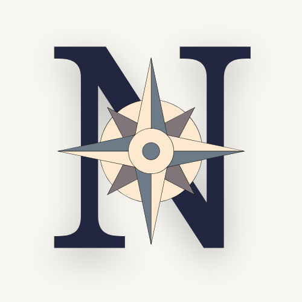

<p align="center">
  
</p>

# Noema Atlas

Noema Atlas is a peer-to-peer network for the weight files behind local language models. A model you already hold can be served straight to someone else's machine, and a model you want can arrive from whichever peers around the world happen to have it, every byte checked against a cryptographic fingerprint as it lands. The mesh is the centre of gravity here. Hugging Face and the usual mirrors are still available, though they sit at the edges as a fallback for when no peer is nearby or a file is too new to have spread.

What keeps the sharing safe is that a file's identity is the digest of its own contents rather than the address it came from. The same weights pulled from a peer on another continent and from the Hub collapse into one verified copy on disk, because the engine trusts a signed manifest about what the bytes ought to be and never the route they travelled. A source provides the bytes and the manifest provides the truth, and every byte is checked against that manifest as it streams in, before anything is written to the cache.

In daily use this behaves like a downloader that keeps its composure when the network does not. When a peer drops away or the Hub slows to a crawl, the engine reaches for another source and carries forward the progress it already had. Tampering surfaces while the transfer is still in flight, and a source caught serving bad data is set aside for the rest of the session. Files that turn out to be identical across model variants or mirrors are stored once rather than over and over, and dropping a model into a project uses a reflink or a hard link, so the second copy costs almost nothing. If the bytes are on your disk and they match the manifest, the model is yours, with no server left in the loop.

## Two programs over one engine

Noema ships two desktop applications. They run on the same core and read the same store beneath your home directory, so a model you fetch or begin sharing in one of them turns up in the other with nothing else to do.

The first, named simply Noema Atlas, paints its interface with a native toolkit and stays light on memory, since it carries no web runtime at all. The second, Noema Studio, lays its interface out in HTML and renders it through the webview your operating system already ships, the engine that sits behind Safari on a Mac or Edge on Windows. Studio asks for more memory and gives back a more modern look. It is worth saying plainly that this is the system webview and not a bundled copy of Chromium, so the cost is real but fairly small. When you are unsure which to take, reach for Atlas, the lighter of the two, which leaves nothing out. Studio is the one to choose when the appearance of the program matters to you more than the memory it occupies.

### Getting a build

Prebuilt downloads sit on the [latest release](https://github.com/noemaai-labs/noema-atlas/releases/latest), and none of them ask you to install a toolchain first.

For Noema Atlas, open `Noema-Atlas-macos.dmg` on a Mac and drag the app into your Applications folder, run `Noema-Atlas-Setup.exe` on Windows, or mark `Noema-Atlas-x86_64.AppImage` executable on Linux and launch it. Release builds for macOS are Developer ID signed and notarized when the signing secrets are configured, which lets them open without a Gatekeeper prompt; otherwise the first launch is a right click and Open.

Noema Studio is attached to the same release, and its installers carry the word Studio in their names. The macOS build needs nothing further, because WebKit comes with the system. On Windows it installs the WebView2 runtime for you if your machine lacks it, and on Linux it expects `webkit2gtk` to be present, which `apt install libwebkit2gtk-4.1-0` will provide.

If you would rather build from source, a recent Rust toolchain is enough for Atlas:

```sh
cargo run -p noema-desktop --release
```

Studio lives in its own workspace and asks for a newer compiler, since the Tauri libraries underneath it want Rust 1.88 or later. Its installers come from `scripts/bundle-studio.sh`, and the development loop is written up in [`crates/studio/README.md`](crates/studio/README.md).

## Working from the terminal

The command line covers the same ground, which helps when you are on a server over SSH or scripting a machine's setup. Searching the Hub and pulling a quantized file is a short sequence:

```sh
noema hf search "llama 3 gguf"
noema hf files  bartowski/Llama-3.2-1B-Instruct-GGUF
noema hf get    bartowski/Llama-3.2-1B-Instruct-GGUF q4_k_m --into ./models
```

That last command downloads the file, checks it against the sha256 the Hub publishes, sets it against anything you already hold so nothing is stored twice, and installs it where you asked.

## Publishing signed, multi-source manifests

A publisher can go further and describe a model with a signed manifest that lists several interchangeable sources for the same content. The signing key is generated once and kept in your operating system's keystore.

```sh
cargo build --release

noema keygen

noema manifest build \
  --name "Qwen3 8B Instruct GGUF" \
  --artifact "qwen3-8b-q4_k_m.gguf=/path/to/model.gguf" \
  --source "qwen3-8b-q4_k_m.gguf:hf:Qwen/Qwen3-8B-Instruct-GGUF@main/qwen3-8b-q4_k_m.gguf" \
  --source "qwen3-8b-q4_k_m.gguf:https:https://mirror.example.com/qwen3-8b-q4_k_m.gguf" \
  --sign <key_id> --out qwen3.json

noema manifest verify --in qwen3.json --trusted <key_id>

noema import   qwen3.json
noema download <manifest_id>
noema install  <manifest_id> ./models/qwen3
```

Once a manifest is imported the engine can draw from any source it names, falling back and resuming across them as the network requires. For a machine you only reach over the wire, `noema ui` serves a small dashboard bound to the loopback address.

## Sharing a model that never lived on Hugging Face

Now and then the weights you want to pass along were taken down from the Hub, or were never there to begin with. You can give such a file a title and a license and hand it to someone over a private link or out on the open mesh. Because the model's own header already records its name and quantization, most of the work is confirming what Noema has read instead of typing it out.

In either desktop app, drop the `.gguf` or `.safetensors` onto the window, or open the share composer from the Library. Set a license, decide whether the link should stay private or be published to the mesh, and create it. The link lands on your clipboard, ready to paste on the device that will receive it.

The same exchange from the terminal looks like this:

```sh
noema import-local ./rescued-model.q4_k_m.gguf \
  --name "Mistral-7B-Instruct-v0.3" --license apache-2.0 --quant Q4_K_M \
  --description "Reupload after the repo was removed" --share
```

A model split across several shards travels under one bundle link, and each file inside it is verified on its own against its content id as it arrives:

```sh
noema share-bundle --name "Llama-3.1-70B-Instruct" --license llama3.1 \
  model-00001-of-00002.safetensors model-00002-of-00002.safetensors \
  config.json tokenizer.json

noema add 'atlasb1:…' --into ./llama-70b
```

Sharing is governed by intent rather than guesswork. The openly licensed models you pull from the public ecosystem are reseeded for you by default, while gated downloads and anything you imported privately stay where they are until you decide otherwise. Noema verifies the content of a file and leaves the question of its license to you, so a model is broadcast only when you have chosen to broadcast it. On the receiving end every byte is checked against the content hash, and the title and license the sender wrote are shown as their claim rather than as established fact.

## Moving files directly between machines over Iroh

Transfers straight from one machine to another run over Iroh, which carries content by its BLAKE3 hash across a QUIC connection that threads its way through NAT with the help of relays. Iroh brings in a large dependency tree, so the command line keeps it behind a feature flag:

```sh
cargo run --release --features iroh -p noema-cli -- iroh-serve ./model.gguf
cargo run --release --features iroh -p noema-cli -- iroh-fetch '<ticket>' ./out.gguf
```

Since Iroh addresses content by the same hash Noema relies on everywhere else, the transfer is verified from one end to the other. Noema Studio is built with this feature already on, so its worldwide sharing works the moment you open it.

## How it stays portable

The engine is plain Rust and steers clear of anything that would pin it to one platform. TLS comes from rustls instead of a system OpenSSL, SQLite is compiled in from source so there is nothing to install alongside it, and secrets go into whatever native keystore the operating system offers, with a read-only fallback to the environment for headless boxes. When it installs a model it prefers a reflink where the filesystem can make one, and where it cannot it falls back to a hard link, and failing that to an ordinary copy. macOS, Windows, and Linux are supported now, and the same `noema-core` compiles into the static and dynamic libraries that the iOS and Android wrappers wrap.

## Repository layout

```
crates/core       the engine: hashing, manifests, the content store, verification, the planner, transports
crates/desktop    Noema Atlas, the native interface
crates/studio     Noema Studio, the HTML interface (its own workspace, Tauri + Svelte)
crates/cli        the command line and the loopback web dashboard
crates/registry   a small service for publishing and resolving signed manifests
```

There is more detail in [`docs/architecture.md`](docs/architecture.md) for the overall design, [`docs/manifest-spec.md`](docs/manifest-spec.md) for the manifest format, and [`docs/threat-model.md`](docs/threat-model.md) for the security model.

## Contributing

Noema Atlas welcomes public collaboration. Start with [`CONTRIBUTING.md`](CONTRIBUTING.md) for the development workflow, review expectations, and project principles. [`GOVERNANCE.md`](GOVERNANCE.md) explains how decisions, triage, and releases work. All project spaces follow [`CODE_OF_CONDUCT.md`](CODE_OF_CONDUCT.md).

Please do not report suspected vulnerabilities in public issues. Use the confidential reporting path in [`SECURITY.md`](SECURITY.md).

## Building the installers

Tagging a release and pushing the tag sets the workflows under [`.github/workflows`](.github/workflows) to work, and they build the one-click installers for every platform and attach them to the release. The macOS builds are Developer ID signed and notarized when the signing secrets are present. You can also produce any installer by hand:

```sh
scripts/bundle-macos.sh --dmg     # Noema Atlas, a macOS .app and .dmg
scripts/bundle-linux.sh           # Noema Atlas, a Linux AppImage
scripts/bundle-windows.ps1        # Noema Atlas, a Windows installer
scripts/bundle-studio.sh          # Noema Studio, for the current platform
```

Studio's installers come from Tauri's own bundler and want Rust 1.88 or newer.

## A note on security

A manifest's signatures are checked before any request leaves the machine. Every byte that comes back is verified, and a file that fails is quarantined rather than committed to the cache, with the source that served it banned for the session. A per-leaf Merkle root is recorded alongside each blob so it can be re-checked in fixed-size chunks later, though catching a single poisoned chunk in the middle of a download, before the rest of the file has arrived, is on the roadmap and not yet in place. Gated and privately imported models are never broadcast to public peers unless you opt them in, whether for one model or through the setting that allows sharing of licensed content. Pickle-class and executable file types are refused by default, while GGUF and Safetensors are accepted and validated against their headers.

## License

Apache-2.0. See [LICENSE](LICENSE).
